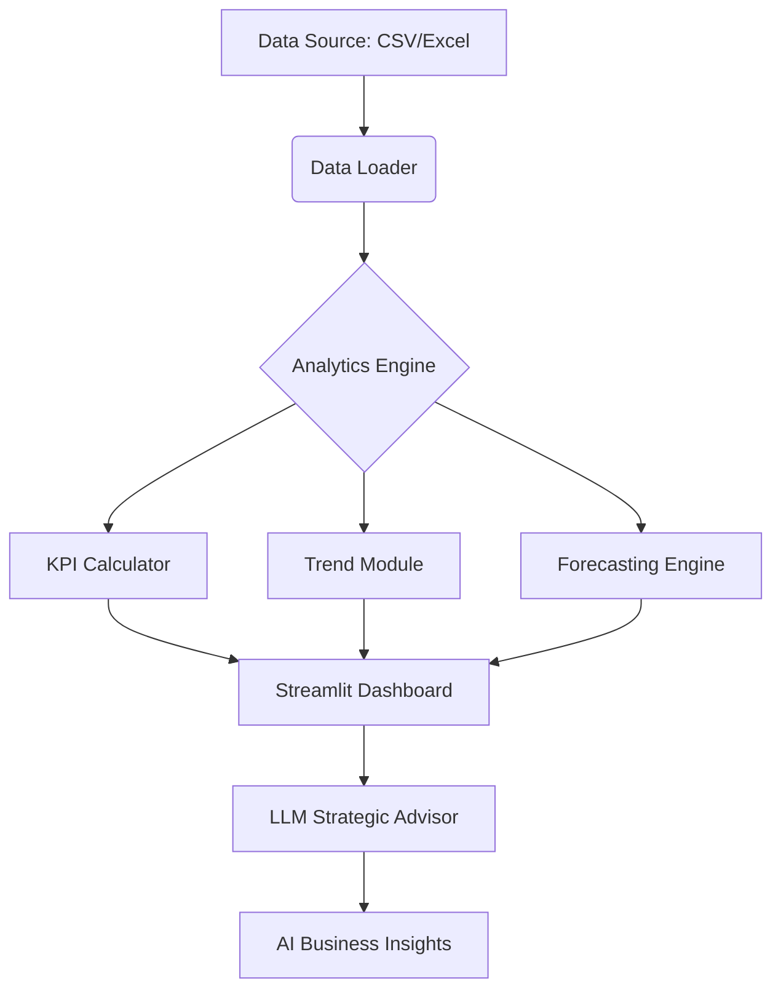

# 🚀 Nexus BI: Performance Analysis Platform

The **Business Performance Analysis Platform** is a sophisticated BI dashboard designed for modern enterprises. It bridges the gap between raw data and strategic execution by combining traditional KPI tracking with cutting-edge Predictive AI and Large Language Models (LLMs).

---

## 🌟 Strategic Value

-   **� Decisive Insights**: Move beyond charts. Our LLM-integrated engine provides narrative-driven strategies based on your specific performance metrics.
-   **📈 Future-Proofing**: Anticipate market shifts with built-in regression-based forecasting.
-   **🛠️ Agile Simulation**: Test business hypotheses in real-time with the What-If Simulator before committing resources.

## ✨ Core Features

| Feature | Description | Benefit |
| :--- | :--- | :--- |
| **KPI Engine** | Real-time calculation of Revenue, Profit, and Margins. | Instant visibility into financial health. |
| **Trend Analysis** | Historical data visualization for revenue and expenses. | Identify seasonal patterns and anomalies. |
| **Forecasting** | 30-day predictive modeling using Linear Regression. | Proactive resource planning. |
| **Scenario Simulator** | Dynamic adjustment of Sales Growth & Expense Reduction. | Risk-free strategic planning. |
| **LLM Insights** | AI-generated strategic advice via OpenAI GPT-4. | Expert-level analysis at your fingertips. |

## 🛠️ Project Architecture



## 🚀 Getting Started

### 1. Installation
```bash
pip install -r requirements.txt
```

### 2. Configuration
Create a `.env` file or set your key in the dashboard:
```bash
OPENAI_API_KEY='your_api_key'
```

### 3. Execution
```bash
streamlit run app.py
```

## �️ Future Roadmap

-   [ ] **Anomaly Detection**: Automated alerts for statistically significant outliers.
-   [ ] **Unit Economics**: Deep dive into LTV, CAC, and Revenue per Sale.
-   [ ] **Multi-Currency Support**: For global business analysis.


